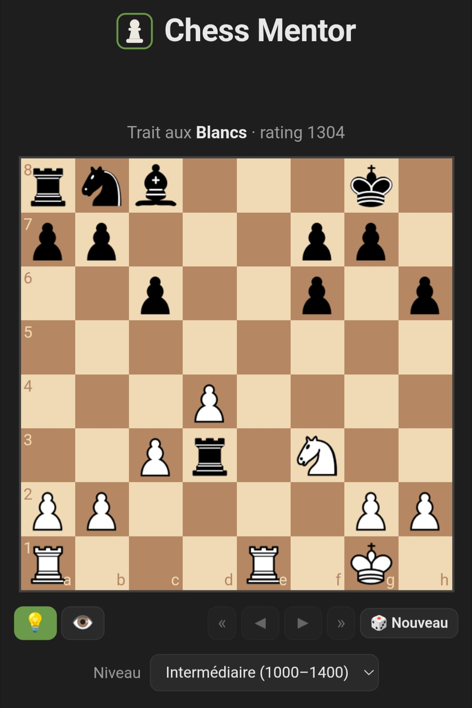

#  Chess Mentor — coach de raisonnement

### 👉 Démo en ligne : **https://chess-mentor-ten.vercel.app**

<p align="center">
  
</p>

Un coach d'échecs qui n'apprend pas à *mémoriser* des solutions, mais à
**raisonner**. Au lieu de balancer le coup, il identifie les **signaux faibles**
d'une position (roi sans case de fuite, pièce non défendue, pièces alignées,
double attaque…) et déroule un raisonnement progressif, comme un entraîneur.

> L'idée : reproduire ce qu'un joueur fort fait quand il donne un problème 1000
> à un joueur 500 *en expliquant son raisonnement* — ça muscle la façon de
> penser. Utilisable du débutant (800) au joueur avancé (2000+).

## Comment ça marche

```
Base de puzzles Lichess (FEN + solution + rating + thèmes)
            │
            ▼
   signal_detectors.py   ← détecteurs DÉTERMINISTES (python-chess) = vérité-terrain
            │                (pièce en prise, roi enfermé, alignements, double attaque…)
            ▼
        coach.py          ← met les signaux VÉRIFIÉS en mots façon coach
            │                (Claude API ; repli sur gabarits si pas de clé)
            ▼
   FastAPI + échiquier web (chessboard.js) — indices progressifs 1→4, multi-coups
```

Le cœur, ce sont les **détecteurs** + l'**annotateur** (`explain.py`) : ils
analysent la solution coup par coup et produisent des indices factuels, sans
jamais inventer un coup ou une pièce.

Un **moteur d'échecs tourne aussi dans le navigateur** (Lozza, UCI, JS pur, GPL-3.0
— `static/lozza.js`) : il fournit la barre d'évaluation et **réfute tes mauvais
essais** (« après ton coup, l'adversaire joue … et tu es perdant »). 100% côté
client : aucun coût serveur, aucun token.

## Lancer en local

```bash
python -m venv .venv && source .venv/bin/activate
pip install -r requirements-dev.txt

# (optionnel) reconstruire la base depuis Lichess — déjà fournie dans data/
python scripts/build_db.py --limit 1500

# narration Claude (sinon : indices-gabarits déterministes)
export ANTHROPIC_API_KEY=sk-ant-...

uvicorn app.main:app --reload   # http://localhost:8000
```

## Déploiement Vercel

Le projet est prêt pour Vercel (Python serverless) :
- `api/index.py` expose l'app ASGI, `vercel.json` route tout vers elle.
- La base `data/puzzles.sqlite` est embarquée (lecture seule).
- **Narration Claude (Haiku) activée par défaut** (~0,2 centime/problème) si
  `ANTHROPIC_API_KEY` est présent. Modèle : `CHESS_COACH_MODEL` (défaut `claude-haiku-4-5`).
  Sans clé (ou `CHESS_COACH_LLM=off`) → indices-gabarits déterministes, gratuits.

### Coût & sécurité (site public)

- **Aucun secret dans le dépôt** : clé Anthropic et tokens Vercel KV vivent uniquement
  dans les variables d'environnement de l'hébergeur (le `.gitignore` couvre `.env*`).
- **Pas de compte ni de données personnelles** : la seule écriture est l'ajout des retours
  volontaires (feedback) dans Vercel KV.
- **Coût LLM maîtrisé** : la narration Haiku coûte ~0,2 centime/problème ; une **limite de
  dépense** est définie côté console Anthropic (Settings → Limits) pour plafonner le risque.
  À défaut, `CHESS_COACH_LLM=off` rend l'app 100 % gratuite (indices-gabarits).
- Pas de limitation de débit intégrée — à ajouter si du trafic important est attendu.

## Retours utilisateurs (feedback)

Un bouton « 💬 Un retour ? » ouvre une petite fenêtre (texte libre + vote 👍/👎). Les retours
sont stockés dans **Vercel KV** (Upstash Redis) avec le contexte (id du puzzle, niveau, date).

Mise en place :
1. Vercel → **Storage → Create Database → KV** → connecte-la au projet (les variables
   `KV_REST_API_URL` / `KV_REST_API_TOKEN` sont injectées automatiquement).
2. Ajoute la variable d'env **`FEEDBACK_ADMIN_KEY`** = un mot de passe de ton choix.
3. Redeploy.

Lecture des retours : ouvre **`/api/feedback/list?key=<FEEDBACK_ADMIN_KEY>`** (page protégée).
Sans KV configuré, l'envoi ne plante pas : le retour est simplement journalisé (logs Vercel).

## Tests

Suite automatique (locale) : backend pytest + E2E navigateur (Playwright) + unitaire JS.

```bash
bash scripts/test.sh        # tout : pytest (backend + E2E) puis node (JS)
# ou à la main :
pip install -r requirements-dev.txt && python -m playwright install chromium
python -m pytest tests/     # backend + E2E
node tests/test_engine.js   # fonctions pures du moteur (engine.js)
```

- `tests/test_*.py` : détecteurs, annotateur `explain` (toute la base), endpoints API
  (+ joueur parfait multi-coups 1500/1500), traductions FR.
- `tests/e2e/` : Playwright pilote l'échiquier (résolution, réfutation, indice, exploration) ;
  se **skippe** proprement si Chromium n'est pas installé.
- Déterminisme E2E : un puzzle précis se charge via `/?puzzle=<id>` (lien partageable).
- `scripts/selftest.py` reste un smoke rapide sans dépendances.

## Endpoints

| Méthode | Route | Rôle |
|---|---|---|
| GET | `/api/puzzle?min_rating=&max_rating=&min_plies=&id=` | tire un puzzle (ou `id` précis), sans la solution |
| POST | `/api/attempt {id, uci, ply}` | valide le coup du solveur, joue la réponse adverse, explique |
| GET | `/api/hints?id=&target_elo=` | les indices progressifs (3 affichés : du vague au précis) |
| GET | `/api/solution?id=` | ligne complète (UCI + SAN + notes) |

## Structure

```
api/index.py            entrée Vercel (ASGI)
app/
  main.py               endpoints FastAPI
  db.py                 accès SQLite
  signal_detectors.py   détecteurs de signaux (le cœur)
  coach.py              indices progressifs + Claude (+ repli gabarits)
  static/               échiquier web (chessboard.js)
data/puzzles.sqlite     base de puzzles (Lichess, CC0)
scripts/build_db.py     (re)construit la base
```

## Crédits & licences

Code du projet : **MIT** (voir `LICENSE`). Composants tiers (chacun sous sa licence) :

| Composant | Usage | Licence |
|---|---|---|
| [Lichess puzzles](https://database.lichess.org/) | base de problèmes (`data/`) | CC0 |
| [Lozza](https://github.com/op12no2/lozza) | moteur d'échecs navigateur (`static/lozza.js`) | GPL-3.0 |
| [chessboard.js](https://chessboardjs.com/) | échiquier | MIT |
| [chess.js](https://github.com/jhlywa/chess.js) | règles côté client | BSD-2-Clause |
| [jQuery](https://jquery.com/) | dépendance de chessboard.js | MIT |
| python-chess, FastAPI | backend | (resp. GPL-3.0, MIT) |
| pièces « cburnett » (via chessboardjs.com) | images des pièces | GPL-2.0+ |

## Licence

Code du projet sous licence **MIT** — voir [`LICENSE`](LICENSE). Les composants tiers
embarqués (notamment Lozza, GPL-3.0) conservent leur propre licence.
